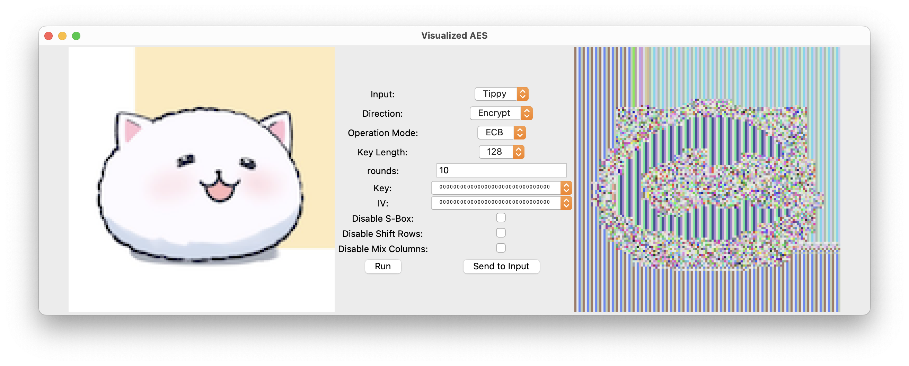
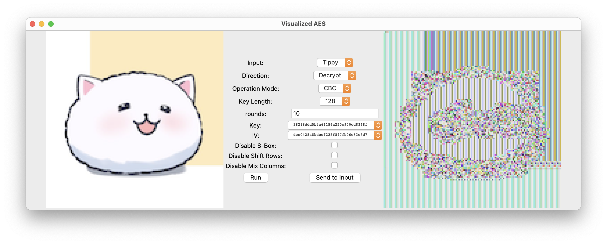
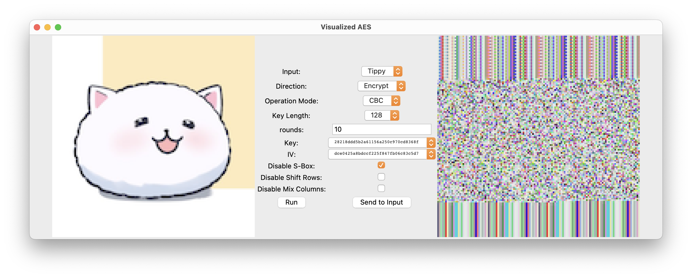
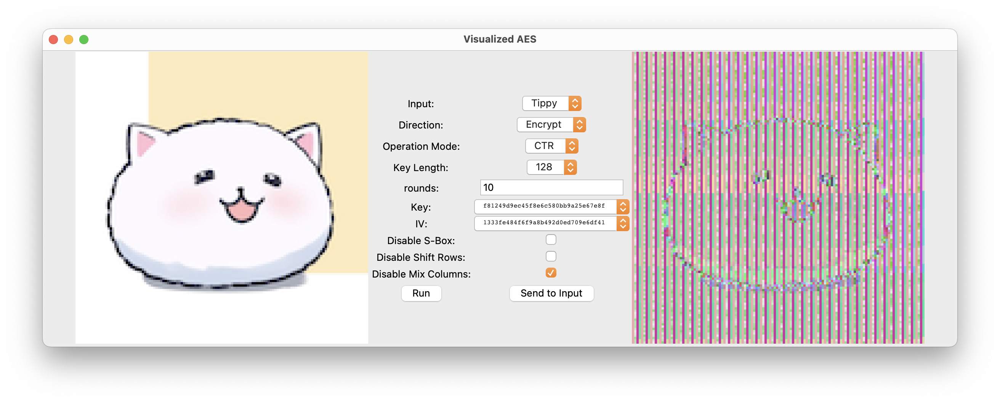
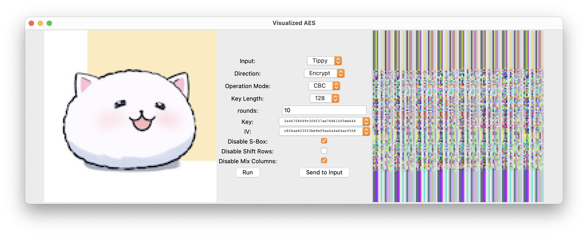
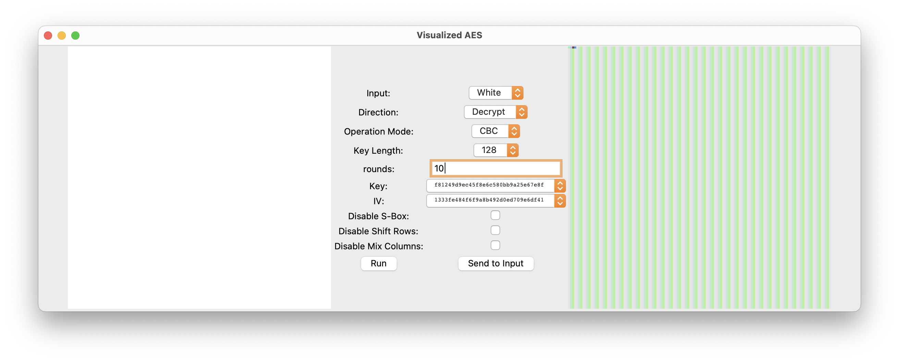

This is a implementation of the AES in pure Python, which allows manipulation of the detaled
operations, such as change the rounds or disable certain steps. The project aims to provide a
clear visualization of the algorithm, and help to understand the details of the AES, including
the following questions:

* What's the different with ECB, CBC, and CTR?
* What if a special key/input/IV is used, e.g. all zeros or all ones?
* What's the result after each round of encryption/decryption?
* What if substitution or permutation is disabled?
* What happens when decrypting a plaintext or encrypting a ciphertext again, or encrypt with one
  mode/key and decrypt with another mode/key?

The example inputs, including the pure color images, are 128x128 pixels with 32-bit (8-bit RGBA)
color depth, which means each pixel has 4 bytes, every 4 pixels form a AES block, and each row
contains contains exactly 32 blocks. This will help the visualization at the block level, and
provide a clear view of the encryption/decryption process.

Some interesting results are shown as follows:

